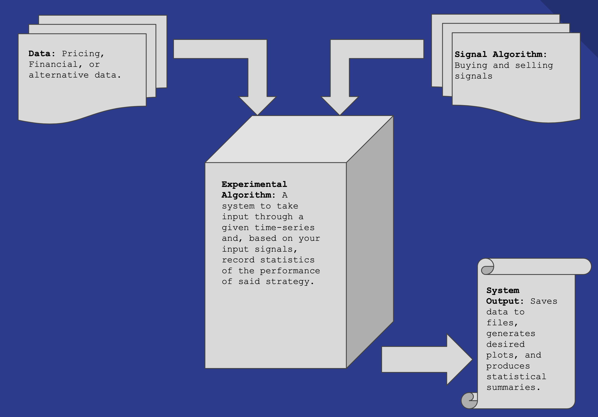

I've built a trading strategy analysis system on my local machine over the past few months and I now intend to transfer it to Github. I'm in the process of doing that. In order to do it such that it will be useful to someone else with their own ideas, I'm going through the process of generalizing it. IE ~ I have a system that takes input data, trading signals, and runs them through a simulation. However, I've built my system to test out, say, a MACD signal used for buying and selling. Obviously there are plenty of other trading signals you could use. Therefore, I'm attempting to generalize this system such that you can simply input whatever trading signal you would like to use. 

The framework for this system is laid out below in this work flow image. Once everything is uploaded, I will have the appropriate codes here, in their general form, such that anyone can download and alter the codes to their liking.

